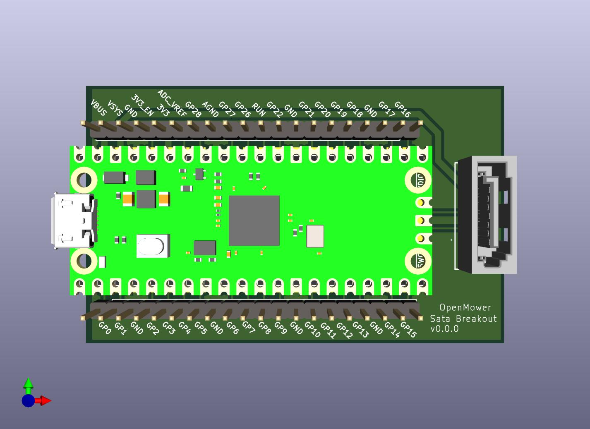
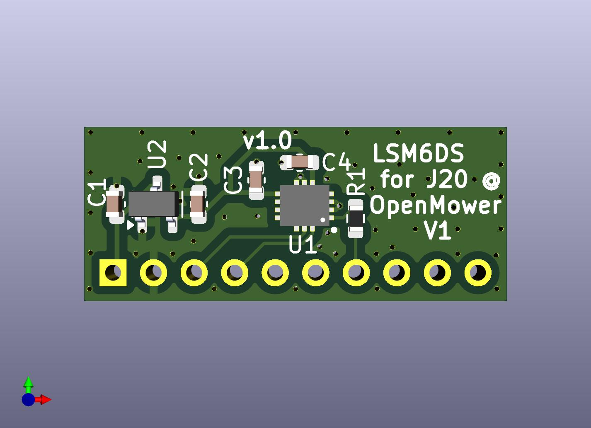

# OpenMower Hardware Utils

## V2 Mainboard Compatible

### SATA- Breakout Board for V2 Hardware

<a href="./hw-openmower-utils-satabob/">

Pico Breakout Board connected via OpenMower's specific SATA plug</a>
 

## V1 Mainboard Compatible

### LSM6DSx IMU for V1 Hardware

<a href="./hw-openmower-utils-v1-j20-lsm6dsx/">

LSM6DSx IMU alternative for J20 @ OpenMower V1 (instead of MPU9250 or WT901)</a>
 