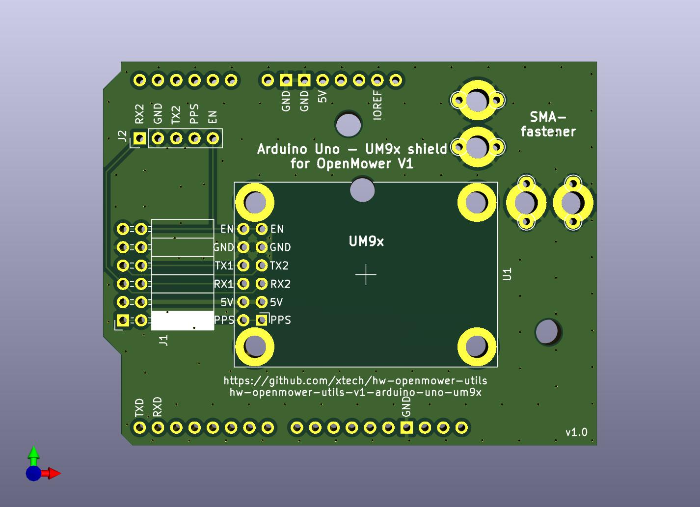
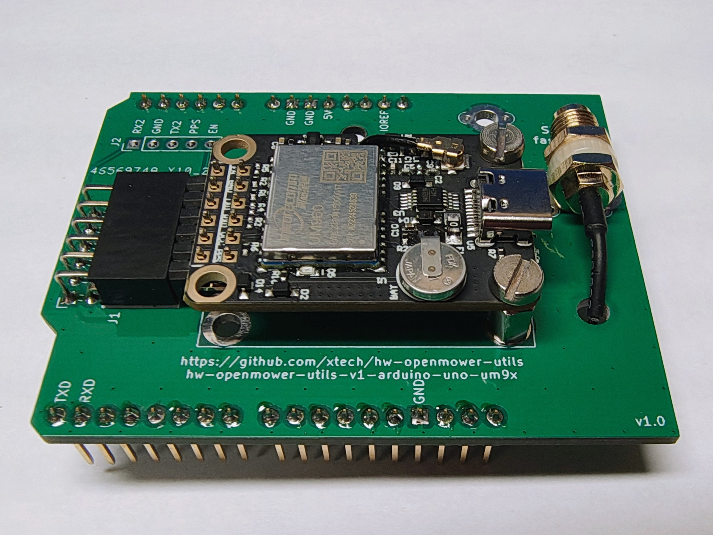
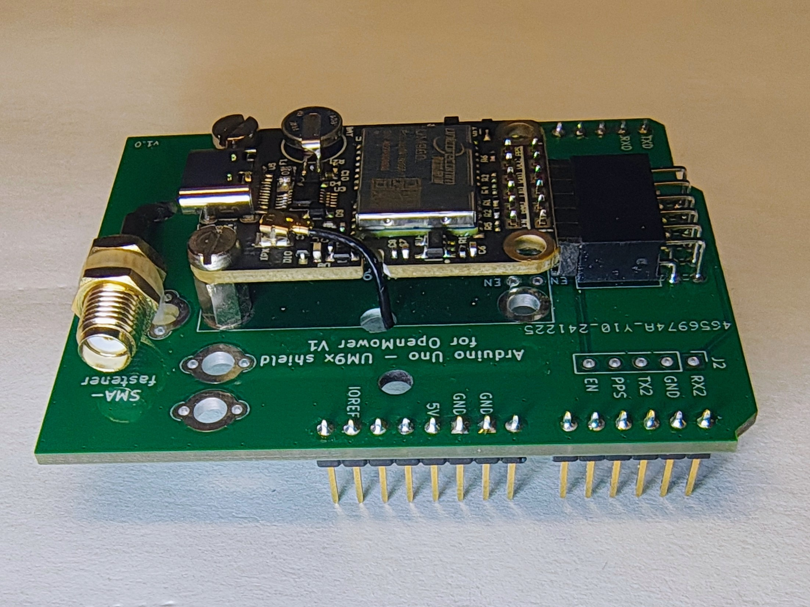

# Arduino Uno - UM9x shield for OpenMower V1 Mainboard



## Installation




### Hardware

In the images above, I used 90° pin headers, but you may also use straight ones, in which case the height will be approx. 5mm higher.

As SMA-fastener I used a simple cable straps, but you can also solder a simple looped- wire and fasten it then there.

### Software

If plugged into OpenMower V1 Mainboard, the UM9x will be available at Raspberry Pi's /dev/ttyAMA1 (like the normal GPS module) and use COM2 of UM9x.

I do configure my UM9x with the following 2 steps:

1. Connect to new UM9x with default baud rate and change to higher baud rate via:<br>
   `miniterm /dev/ttyAMA1 115200 -e` and enter:<br>
   FRESET<kbd>⏎ Enter</kbd><br>
   CONFIG COM2 460800<kbd>⏎ Enter</kbd><br>
   Now exit miniterm via <kbd>Ctrl</kbd> + <kbd>]</kbd><br>

1. Connect again to UM9x but with new/higher baud rate via:<br>
   `miniterm /dev/ttyAMA1 460800 -e` and configure GNSS i.e. via:<br>
   MODE ROVER UAV<kbd>⏎ Enter</kbd><br>
   GPGSV COM2 2<kbd>⏎ Enter</kbd><br>
   GPRMC COM2 1<kbd>⏎ Enter</kbd><br>
   GPGSA COM2 1<kbd>⏎ Enter</kbd><br>
   GPVTG COM2 1<kbd>⏎ Enter</kbd><br>
   GPGGA COM2 0.5<kbd>⏎ Enter</kbd><br>
   SAVECONFIG<kbd>⏎ Enter</kbd><br>
   Exit miniterm via <kbd>Ctrl</kbd> + <kbd>]</kbd><br>

Lastly, you need to adapt your mower_config. Change or add the following two lines:<br>

```
export OM_GPS_PROTOCOL=NMEA
export OM_GPS_BAUDRATE=460800
```


## Availability / Production

Pretty cheap to produce (except shipping). Nothing special.

If interested (and resident in EU), I've probably some spares left (for some €). Contact me @Apehaenger in [Discord](https://discord.gg/jE7QNaSxW7)

<p align="right">(<a href="#readme-top">back to top</a>)</p>
