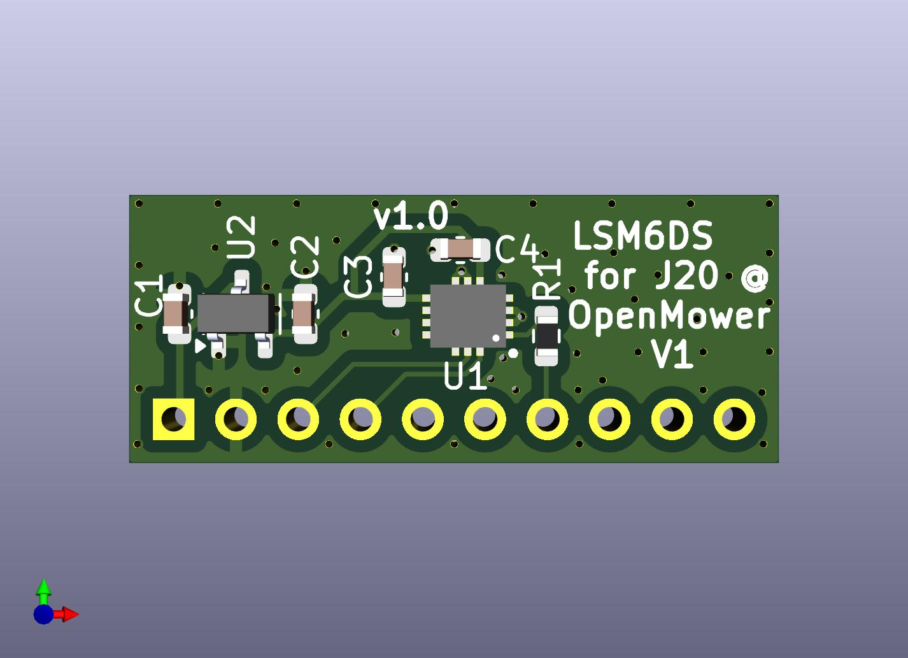

# LSM6DSx IMU for J20 @ V1 Mainboard

## Motivation

OpenMower V1 Mainboard 0.9.x up to 0.10.x requires an external plugged in IMU into J20. 
Unfortunately you don't get a non-faked MPU9250 anymore, so the only alternative you had, is the (non-cheap) WT901 for which you also need to solder an adapter (if you don't wanna block your sound option).

That's why I designed this alternative.

## Compatibility

I used and tested this only on an OpenMower (V1) 0.9.x Mainboard, but it should be compatible also for 0.9.x up to 0.13.x Mainboard variants.
So you should be also able to use it for the case that you've a damaged or malfunction mainboard-assembled IMU (if you disable/remove the assembled one before).

## Installation

Plug into J20 (take attention to Pin-1 direction) and install Firmware with "_LSM6DSO" suffix (for 0.9.x up to 0.11.x). As of 0.12.x LSM6DSO is compiled in by default.

## Availability / Production

Due to the LGA package of LSM6DSx, PCBA production is relatively expensive in special for lower number of pieces (<20).

Please contact me at `joerg` at `ebeling` dot `ws`, I've probably some tested prototypes with an assembled LSM6DSO left for sell. 
If you're good in Hot-Plate soldering, I also have some prototypes without assembled LSM6DSO...

(<a href="#readme-top">back to top</a>)

